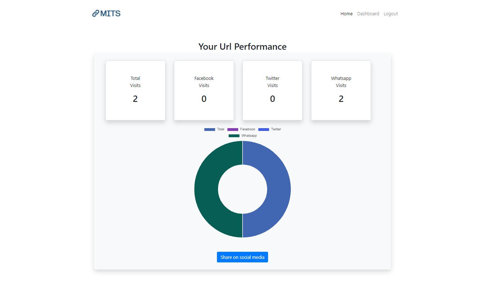
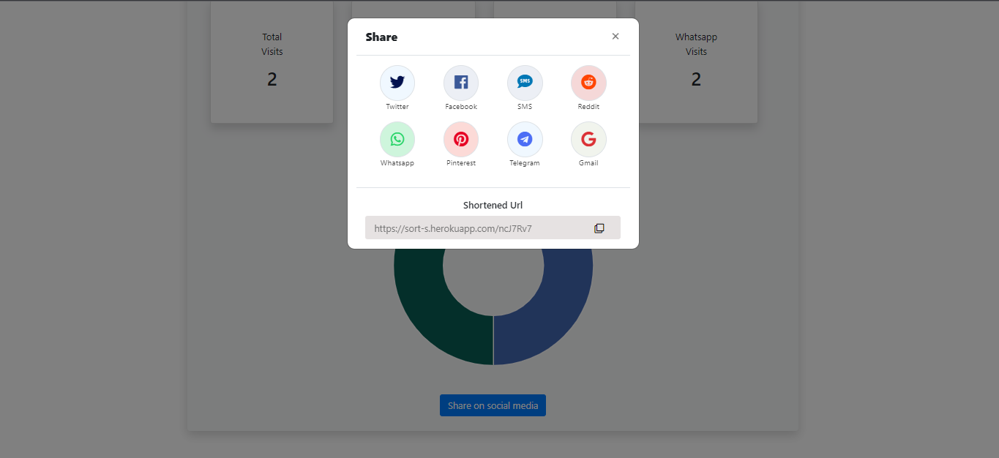

# MakeItShort - A Short Url Service In Node JS With Data Visualization

This repo contains code for a Short URl Service Coded In NODE JS !

## Demo (MakeItShort) : [Here](https://youtu.be/H1offcufv2I)
## Project link (MakeItShort) : [Here](https://sort-s.herokuapp.com/)
## Project Discription (MakeItShort) : [Here]()


## 1. USAGE

### Install All Packages

```bash
npm install express ejs mongoose bcryptjs connect-flash cookie-parser express-session csurf memorystore passport passport-local passport-google-oauth20 nodemailer random-string
```
### Or
```
npm install
```
# To start project
### Start by using 

```bash
node app.js
```
## Or
### Install Nodemon For Development for continous run

```bash
npm install -D nodemon
```
# Features
## Add mongoURI ,Google client ID and Secret, smtp config to send emails , Number of visitor from specific socail media with graphical representaion 


# Added Options
## Home 

## Dashboard 

## Analysis Page

## Sharing Page

